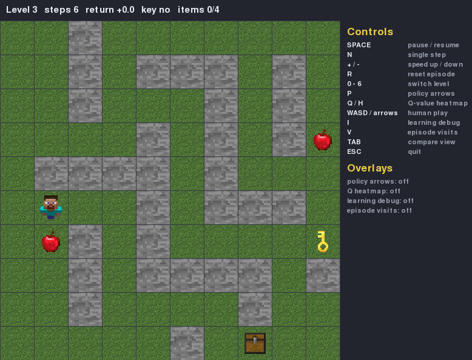
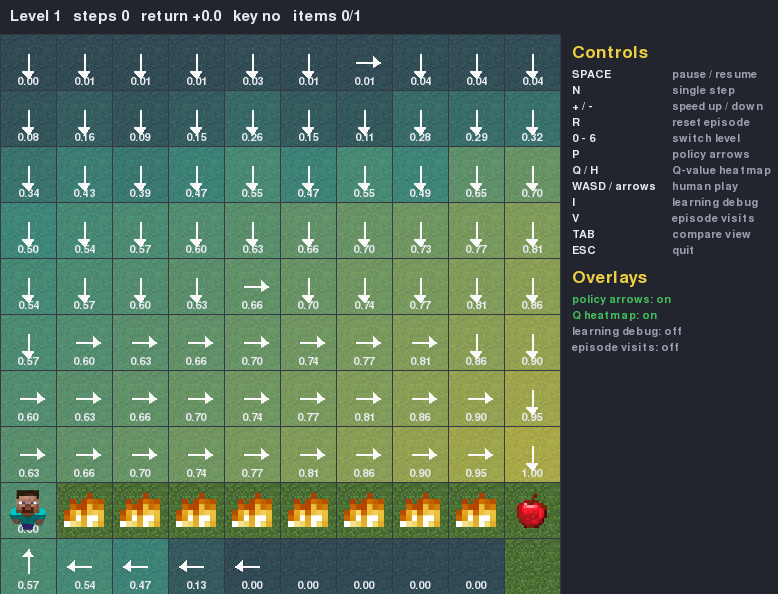
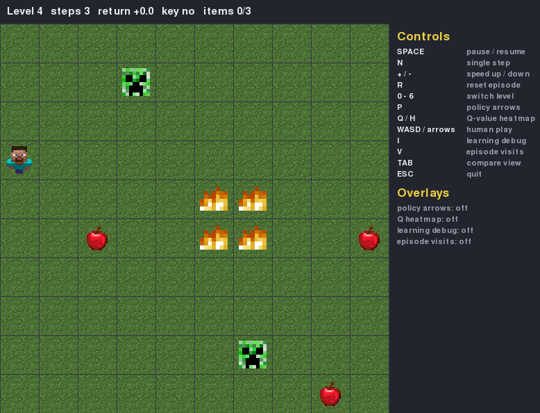
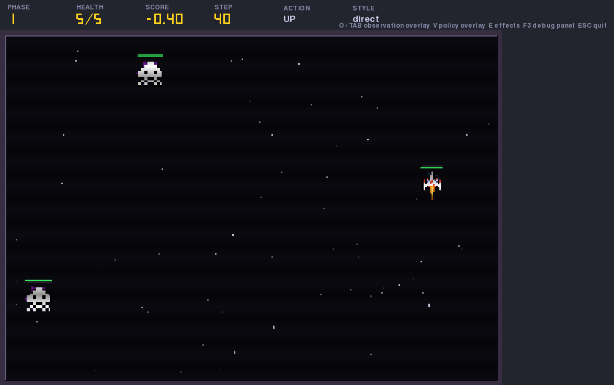
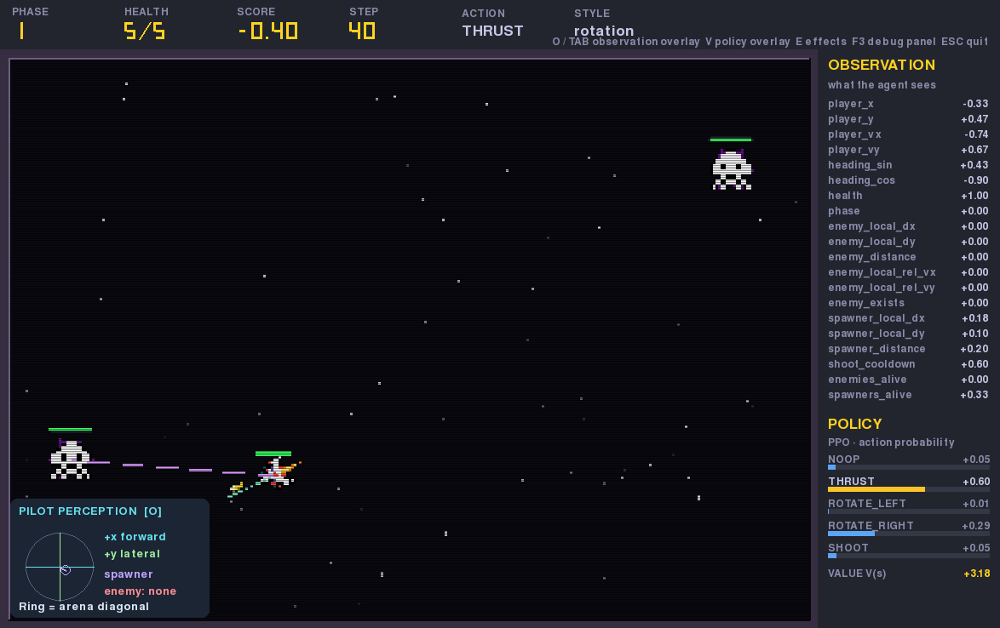

# A3 — Reinforcement Learning and DL Agents

Games and Artificial Intelligence Techniques · RMIT · Group of 3 · 40% of course grade
**Due: 13 September 2026, 11:59 PM**

Part I is tabular Q-learning and SARSA in a Pygame gridworld across seven levels. Part II is a
real-time Pygame arena with two deep RL agents trained by Stable Baselines3, one per control scheme.

The fixed rewards and
mechanics it defines are mirrored in `gridworld/constants.py` and `arena/constants.py` and guarded
by the test suite. **Where anything disagrees with the brief, the brief wins.**

## For the Marker

Three commands are enough to see everything working from a fresh clone:

```bash
pip install -r requirements.txt && pytest        # the spec-guard suite: should be all green
python -m eval.play_gridworld --level 1 --compare # Part I: Q-learning vs SARSA, side by side
python -m eval.play_arena --style rotation        # Part II: the trained deep RL agent, live
```

If a window can't be opened on the machine grading this, every result is already written to
`results/` and `docs/tickets/`. The [screenshots](#a-visual-tour) below show what each command
produces. The [rubric coverage map](#rubric-coverage-map) links each mark to the code and evidence
for it. The [creativity section](#creativity-beyond-the-brief-5-pts) covers what was built beyond
the brief.

## A visual tour

Screenshots are generated by [`scripts/capture_screenshots.py`](scripts/capture_screenshots.py)
instead of captured by hand, so they can be regenerated after any UI change. See
[Keeping the screenshots current](#keeping-the-screenshots-current).

**Part I — the gridworld**

|                                                                                                     |                                                                                                                     |
| --------------------------------------------------------------------------------------------------- | ------------------------------------------------------------------------------------------------------------------- |
|  |  |
| Level 3, multiple apples, a key and a chest in one layout (rubric **D1**).                          | Level 1, policy-arrow and Q-heatmap overlays on (`P` / `Q`), showing the learned policy on screen (**B5**, **C3**). |
|   |                                                                                                                     |
| Level 4, monsters that move after every agent action and kill on contact (Task 4).                  |                                                                                                                     |

**Part II — the arena**

|                                                                                                    |                                                                                                                                                                                                         |
| -------------------------------------------------------------------------------------------------- | ------------------------------------------------------------------------------------------------------------------------------------------------------------------------------------------------------- |
|  |                                                                                         |
| Direct control scheme: ship movement, enemy spawners, bullets and collisions (**G2**).             | Rotation control scheme with the observation panel (`O`) and policy panel (`V`) open: the live 20-feature vector (**H2**) and the trained PPO network's action probabilities and `V(s)` (**I**, **J**). |

## Rubric coverage map

All 40 points, by the exact criteria the brief's rubric names them (`A3_Brief.pdf`, pp. 16–19).
Use this to jump straight from a mark to the code that earns it and the file that proves it.

| Row                           | Pts    | Criteria                                                                                                                                                             | Lives in                                                                                                                               | Evidence                                                                                                                                              |
| ----------------------------- | ------ | -------------------------------------------------------------------------------------------------------------------------------------------------------------------- | -------------------------------------------------------------------------------------------------------------------------------------- | ----------------------------------------------------------------------------------------------------------------------------------------------------- |
| **A** — Gridworld rules       | 2      | A1 visually rendered, animated, interactive · A2 mechanics match spec                                                                                                | [`gridworld/env.py`](gridworld/env.py), [`gridworld/render.py`](gridworld/render.py), [`gridworld/levels.py`](gridworld/levels.py)     | `python -m gridworld.render`                                                                                                                          |
| **B** — Q-learning            | 2.5    | B1 epsilon-greedy · B2 off-policy max-next update · B3 config-driven linear ε decay · B4 random tie-break · B5 learns the Level 0 shortest path                      | [`gridworld/algorithms.py`](gridworld/algorithms.py), [`common/schedules.py`](common/schedules.py)                                     | [`results/levels0-5_seeds0-1-2.md`](results/levels0-5_seeds0-1-2.md)                                                                                  |
| **C** — SARSA                 | 3      | C1 on-policy chosen-next update · C2 same ε schedule as Q-learning · C3 measurably more hazard-averse                                                                | [`gridworld/algorithms.py`](gridworld/algorithms.py)                                                                                   | [`results/comparison_level1_seed*.md`](results/), `compare_level1_seed*.png`                                                                          |
| **D** — Levels 2–3            | 3      | D1 multiple apples + key + chest · D2 both algorithms terminate and account reward correctly                                                                         | [`gridworld/levels.py`](gridworld/levels.py), [`train/train_gridworld.py`](train/train_gridworld.py)                                   | [`results/levels0-5_seeds0-1-2.md`](results/levels0-5_seeds0-1-2.md)                                                                                  |
| **F** — Intrinsic reward      | 3      | count-based `r_i = strength / sqrt(n(s)+1)`, per-episode `n(s)`, inside the Q/SARSA update, env reward untouched                                                     | [`gridworld/algorithms.py`](gridworld/algorithms.py) (level 6)                                                                         | [`results/intrinsic_level6_q.md`](results/intrinsic_level6_q.md)                                                                                      |
| **G** — Arena environment     | 4.5    | G1 real-time, animated, not tile-grid · G2 ship + shoot + spawners + navigating enemies + collisions · G3 health, phase system, correct termination                  | [`arena/entities.py`](arena/entities.py), [`arena/render.py`](arena/render.py)                                                         | `python -m eval.play_arena --style direct --human`                                                                                                    |
| **H** — Gym API + observation | 2.5    | H1 `reset/step/render` · H2 fixed-size numeric vector with the required features                                                                                     | [`arena/env.py`](arena/env.py), [`arena/observation.py`](arena/observation.py)                                                         | [`results/arena_validation/validation.md`](results/arena_validation/validation.md)                                                                    |
| **I** — Two control schemes   | 4      | I1 rotation scheme · I2 direct scheme · I3 a separately trained model each · I4 a separate eval script each                                                          | [`arena/constants.py`](arena/constants.py), [`train/train_arena.py`](train/train_arena.py), [`eval/play_arena.py`](eval/play_arena.py) | [`results/arena_eval/comparison.md`](results/arena_eval/comparison.md) vs. [`comparison_random.md`](results/arena_eval/comparison_random.md) baseline |
| **J** — Reward + DL training  | 3      | J1 reward encourages progression · J2 SB3 PPO, MLP ≥1 hidden layer, TensorBoard · J3 a real hyperparameter sweep                                                     | [`arena/env.py`](arena/env.py), [`train/train_arena.py`](train/train_arena.py), [`train/sweep_arena.py`](train/sweep_arena.py)         | [`results/arena_sweep/sweep_table.md`](results/arena_sweep/sweep_table.md)                                                                            |
| **R** — Report                | 2.5    | R1 ≤10 pages · R2 both envs described · R3 observation design · R4 reward design justified · R5 hyperparameter evidence · R6 control-scheme comparison + originality | [`report/report.md`](report/report.md)                                                                                                 | —                                                                                                                                                     |
| **V** — Video demo            | 5      | ≤10 min, everyone presents ≥1 part, both parts shown live with learned (not random) behaviour, both control schemes                                                  | —                                                                                                                                      | video link in the report                                                                                                                              |
| **Creativity**                | 5      | shown beyond what the brief asked for                                                                                                                                | see [below](#creativity-beyond-the-brief-5-pts)                                                                                        | —                                                                                                                                                     |
| **Total**                     | **40** |                                                                                                                                                                      |                                                                                                                                        |                                                                                                                                                       |

Levels 4–5 (monster movement, Task 4) are required by the brief but carry no rubric row of their
own. The team tracks them as quality evidence under A/D. `docs/tickets/INDEX.md` is the live
board and shows which of the rows above are done, and what's still open.

## Creativity — beyond the brief (5 pts)

Three additions the brief does not ask for, each demonstrable live rather than only in code:

- **Gridworld learning-internals debug panel** (`I` in `eval/play_gridworld.py`): the actual TD
  update as it happens, Q-values before/after, the TD target/error, the ε-greedy roll and branch
  taken, and on level 6, the intrinsic reward's `n(s)` and bonus. It shows the difference between
  Q-learning's off-policy `max` and SARSA's on-policy chosen-action update directly on screen.
  See ticket [A3-029](docs/tickets/A3-029-add-gridworld-learning-internals-debug-overlay.md).
- **Arena mechanics: shield pickups and elite chargers** (`--mechanics` in `eval/play_arena.py` and
  `train/train_arena.py`) — a collectible one-hit shield dropped by destroyed spawners, and an elite
  enemy with a distinct pursuit → telegraphed wind-up → charge → recovery attack pattern. Both are
  opt-in, trained as a separate 36-feature policy so the baseline models and results are untouched.
  See [`docs/arena-mechanics.md`](docs/arena-mechanics.md).
- **Arena combat feedback and the pilot-perception compass** — muzzle flash, hit/death particles and
  screen shake (`E` to toggle), plus a compass translating the ship-relative observation features
  into the same picture a human pilot would use, so a marker can compare what the agent "sees"
  against what a human would react to. Purely a renderer-side read of existing state: it never
  writes back into the simulation. See [`docs/arena-creativity.md`](docs/arena-creativity.md).

Visual themes for both games (sprite art replacing placeholder shapes, in `assets/gridworld/` and
`assets/arena/`) support the demo but are not counted as one of the two required creativity systems
by themselves.

```bash
python -m eval.play_gridworld --learn --level 6 --algo q --intrinsic-strength 0.5   # debug panel
python -m eval.play_arena --human --style direct --mechanics --seed 0               # shield + elite
python -m eval.play_arena --human --style rotation --mechanics --seed 0
```

Destroy spawners to drop shield orbs; collect one to absorb a hit. From phase 2, dodge the elite's
telegraphed charge and defeat it to finish the phase. Both mechanics use the existing action sets.
Train new 36-feature policies with `python -m train.train_arena --style direct --mechanics`
(repeat for `rotation`); they save under `models/mechanics/`, separate from the baseline models
in `models/`. Omitting `--mechanics` everywhere keeps the baseline behaviour and checkpoints
untouched.

## Team

| Member           | Student number | Owns                                                                                                                                                                                                                                                               |
| ---------------- | -------------- | ------------------------------------------------------------------------------------------------------------------------------------------------------------------------------------------------------------------------------------------------------------------ |
| Huynh Thai Duong | s3978955       | Both environments end to end: gridworld core, renderer, levels 0–6, Q-learning, SARSA, the intrinsic reward experiment; arena entities/physics, the Gym-style API, the arena renderer/HUD, and training + evaluation for both control schemes                      |
| Do Le Trang Hanh | s3977994       | Part II training rigor: the TensorBoard pipeline, the hyperparameter sweep, environment validation, a stale-observation regression fix and retrain; on-screen algorithm visibility across both environments; process (ticket board, milestone audits, this README) |
| Tran Minh Nghia  | s4123236       | Creativity beyond the brief: opt-in arena mechanics (shield pickups, elite chargers) with matching visual effects, the gridworld learning-internals debug overlay, and arena policy/reward/physics debugging tooling                                               |

Part II training, evaluation, the sweep and the report are shared work: Part II is roughly half the
marks and too large for one person. A fuller, per-commit breakdown is in
[Contributions](#contributions) below, and the exact text for the report's contribution table is in
[`report/contributions.md`](report/contributions.md). Ticket
[A3-017](docs/tickets/A3-017-decide-ownership-and-fill-in-the.md) still needs the individual ticket
owner fields (A3-001–A3-015) filled in before it can close; everyone must also appear in the video
presenting at least one part.

## Contributions

Derived from `git log`, not self-reported. Every claim below traces to a commit subject on `main`.

**Huynh Thai Duong (s3978955)** built both environments end to end. Part I: the gridworld
constants, seven level layouts and environment core (rubric A), the Pygame renderer, Q-learning on
level 0 (B), SARSA with the level 1 comparison (C), and the extension through levels 2–6 including
the intrinsic reward experiment (D, F). Part II: the arena entity simulation and physics (G), the
Gym-style API with the literal 4-tuple legacy adapter (H), the arena renderer/HUD/observation
overlay, and the training and playback scripts for both control schemes (I). Also set up the repo
scaffolding and the file-based ticket-tracking workflow.

**Do Le Trang Hanh (s3977994)** built the training and measurement rigor behind Part II and the
visibility work that makes both parts' algorithms inspectable on screen. Specifically: the
TensorBoard-logged training pipeline (J2), the hyperparameter sweep and its tabulation (J3),
pre-training environment validation and playback-before-training checks, diagnosing and fixing a
stale-observation-feature regression with a full retrain, and re-measuring the arena evaluation
tables against the corrected models. Also wrote the milestone evaluation audits in
`docs/evaluations/`, curated the ticket board and README.

**Tran Minh Nghia (s4123236)** implemented the project's creativity work: opt-in arena mechanics
(shield pickups, elite charger enemies) with matching visual feedback (muzzle flash, hit/death
particles, screen shake), the gridworld learning-internals debug overlay that exposes the live TD
update (Q-values before/after, TD target and error, the ε-greedy branch taken, and the intrinsic
reward breakdown), and arena policy/reward/physics debugging tooling.

## Setup

Python 3.11+. Verified on 3.14.6 (macOS) and 3.14.4 (Windows). From the repo root:

```bash
# macOS / Linux
python3 -m venv .venv
source .venv/bin/activate
pip install -r requirements.txt
pytest
```

```powershell
# Windows
python -m venv .venv
.venv\Scripts\activate
pip install -r requirements.txt
pytest
```

`pytest` should report all tests passing before you write anything. The suite guards the brief's
fixed rewards and mechanics; if it fails, something has drifted from the spec. Everything is
headless and quick except the sweep test, which trains a real model; `pytest -m "not slow"` skips it.

## Commands

```bash
# Launcher — pick a part, level/style and agent-vs-human from one retro menu screen
python -m eval.launcher
# Part I — training
python -m train.train_gridworld --level 0 --algo q
python -m train.train_gridworld --level 1 --algo sarsa
python -m train.train_gridworld --level 1 --compare    # C3: both algorithms, one config,
                                                       # side-by-side policy figure + death rates
python -m train.train_gridworld --levels 0 1 2 3 4 5 --seeds 0 1 2  # D + monsters: order, rates
python -m train.train_gridworld --level 6 --intrinsic-sweep     # F: intrinsic reward, 0.0 vs 0.5

# Part I — playback (this is what the video records)
python -m eval.play_gridworld --level 0 --algo q       # play a trained policy, arrows overlaid
python -m eval.play_gridworld --level 4 --algo sarsa   # monsters, stochastic transitions
python -m eval.play_gridworld --level 1 --compare      # the same contrast animated, for the video
python -m gridworld.render                             # A1: play any level by hand, no agent

# Part II — training
python -m train.train_arena --style direct
python -m train.train_arena --style rotation
python -m train.sweep_arena --dry-run                  # J3: the sweep's run plan, no training
python -m train.sweep_arena                            # J3: explore, confirm on 3 seeds, retrain,
                                                       # then the deterministic head-to-head
python -m train.sweep_arena --report-only --promote    # re-measure the head-to-head on the models
                                                       # already on disk, without retraining

# Part II — playback
python -m eval.play_arena --style rotation
python -m eval.play_arena --style direct --human       # G: play the same env from the keyboard
python -m eval.play_arena --style direct --random      # the chance-level baseline; also what runs
                                                       # by itself when models/ is still empty
python -m eval.play_arena --style both --no-window     # R6: writes results/arena_eval/ (30 ep/style)
tensorboard --logdir logs

# README screenshots
python -m scripts.capture_screenshots                  # regenerate assets/screenshots/*.png
```

Both trainers take `--seed`, and every artifact they write carries the seed in its filename, so any
number in `results/` can be reproduced from the command in the file that reports it.

## Controls

The project is marked partly from a live demo, so both windows are driveable from the keyboard.

**Gridworld** (`eval/play_gridworld.py`, `gridworld.render`)

| Key             | Does                                                                             |
| --------------- | -------------------------------------------------------------------------------- |
| `SPACE`         | pause / resume playback                                                          |
| `N`             | single-step the policy                                                           |
| `+` / `-`       | speed up / slow down                                                             |
| `R`             | reset the episode                                                                |
| `0`–`6`         | switch level — every level's trained table is loaded, not just the one requested |
| `P`             | greedy policy arrows                                                             |
| `Q` / `H`       | per-cell Q-value heatmap                                                         |
| `I`             | latest real learning update panel (creativity)                                   |
| `V`             | episode visit-count heatmap (separate from Q values)                             |
| `TAB`           | comparison view: both panels → Q-learning → SARSA → both                         |
| arrows / `WASD` | take the move yourself; playback pauses so you and the policy cannot fight       |
| `ESC`           | quit                                                                             |

To demonstrate the learning math, start an opt-in live session (fresh in-memory tables,
no saved artefacts modified):

```bash
python -m eval.play_gridworld --learn --level 1 --compare --env-seed 0 --policy-seed 0
python -m eval.play_gridworld --learn --level 6 --algo sarsa --intrinsic-strength 0.5
```

Live sessions start paused with the debug panel open. Press `N` for one actual update,
`SPACE` to run/pause, and `V` to show episode cell visits. `TAB` selects a comparison
panel while both learners keep stepping together. `R` starts the next learning episode,
retaining Q values and advancing the configured epsilon schedule; switching levels clears
the latest update and counts and starts that level's schedule while retaining its in-memory
table. A paused terminal frame stays visible until resumed or reset.

The panel captures the epsilon roll and selection branch, Q before/after, and the actual
TD target/error. SARSA shows the successor action it carries into the following step;
Q-learning shows the maximum successor value. Termination zeros the bootstrap;
truncation retains it. On level 6, the intrinsic bonus uses the full arrival state's
**pre-arrival** count; the spatial heatmap aggregates cell occupancies including the start.
Human moves clear the update panel because they do not perform learning updates.
Ordinary playback remains frozen-table evaluation and cannot show historical learning math.

**Arena** (`eval/play_arena.py`)

| Key             | Does                                                                    |
| --------------- | ----------------------------------------------------------------------- |
| `O` / `TAB`     | observation overlay — all 20 features, live                             |
| `V`             | policy overlay — action probabilities and `V(s)`                        |
| `F3`            | reward/physics debug panel (creativity)                                 |
| `E`             | toggle combat feedback: muzzle flash, hit/death particles, screen shake |
| arrows / `WASD` | human play: move (`direct`) or rotate and thrust (`rotation`)           |
| `SPACE`         | human play: shoot                                                       |
| `ESC`           | quit                                                                    |

## What is visible on screen

Algorithm internals are rendered on screen, not only logged, so anything a marker needs to see is
in the window.

| Where                                       | Shows                                                                                                                                                                |
| ------------------------------------------- | -------------------------------------------------------------------------------------------------------------------------------------------------------------------- |
| Gridworld HUD                               | level, steps, return, key held, items collected, speed                                                                                                               |
| Gridworld **Learner** panel                 | algorithm name, alpha, gamma, the epsilon schedule and the episode budget that trained the policy on screen — read from the run's own summary, never from the config |
| Gridworld overlays                          | greedy policy arrows (`P`), per-cell Q-value heatmap (`Q` / `H`)                                                                                                     |
| Arena HUD                                   | phase, health, score, step, current action, control style                                                                                                            |
| Arena **observation** overlay (`O` / `TAB`) | all 20 features live, plus lines to the nearest enemy and spawner and the ship-local heading                                                                         |
| Arena **policy** overlay (`V`)              | the action probability the network assigned to every action, the one it chose, and the critic's `V(s)`                                                               |

In `--compare` mode the two gridworld panels each carry their own Learner block, so "Q-learning and
SARSA share one exploration schedule" is visible on screen rather than stated in the report alone.

## Where the evidence lives

Every table below is generated by the command named inside it, against a stated commit and seed.
Cite these in the report rather than re-deriving numbers by hand.

| File                                                                                 | Covers                                                                                                                                        |
| ------------------------------------------------------------------------------------ | --------------------------------------------------------------------------------------------------------------------------------------------- |
| [`results/levels0-5_seeds0-1-2.md`](results/levels0-5_seeds0-1-2.md)                 | rows B/C/D: both algorithms on levels 0–5, 3 seeds — solved, greedy steps vs the BFS optimum, collection order, key-before-chest, death rates |
| [`results/comparison_level1_seed*.md`](results/)                                     | row C3: the Q-learning vs SARSA contrast, with `compare_level1_seed*.png`                                                                     |
| [`results/intrinsic_level6_q.md`](results/intrinsic_level6_q.md)                     | row F: the count-based bonus swept over five strengths and five seeds — an honest negative result                                             |
| [`results/arena_sweep/sweep_table.md`](results/arena_sweep/sweep_table.md)           | row J3: the hyperparameter sweep, one axis at a time, confirmed across seeds, with a reward-hacking flag                                      |
| [`results/arena_eval/comparison.md`](results/arena_eval/comparison.md)               | row I: the two control schemes measured head-to-head on the same seeded arenas                                                                |
| [`results/arena_validation/validation.md`](results/arena_validation/validation.md)   | row H: the observation vector stress-tested — per-feature ranges, dead/saturated features by name, determinism, termination and steps/second  |
| [`results/arena_eval/comparison_random.md`](results/arena_eval/comparison_random.md) | row I: the same 30 seeded arenas under a uniform random policy — the baseline that makes "clears 28 of 30" mean something                     |
| [`docs/evaluations/`](docs/evaluations/)                                             | dated whole-project audits against the rubric, each pinned to the commit it measured                                                          |

`results/` also holds the training curves, policy figures, per-run summaries, episode histories and
saved Q-tables that the playback scripts load.

## Keeping the screenshots current

The images in [A visual tour](#a-visual-tour) live in `assets/screenshots/` and are never edited by
hand. [`scripts/capture_screenshots.py`](scripts/capture_screenshots.py) draws each frame headlessly
(`SDL_VIDEODRIVER=dummy`, the same approach the render test suite uses) from the real
`GridRenderer` / `ArenaRenderer` classes, using whatever Q-tables and PPO models are currently in
`results/` and `models/`. A sprite change, a HUD layout change, or a retrain all show up the next
time it runs, with no README edit required:

```bash
python -m scripts.capture_screenshots
```

The README links to the files by their fixed, purpose-named path (`gridworld_gameplay.png`, not
something commit- or run-specific), so regenerating never breaks the links above. It only changes
what they point at.

## Layout

```
common/      config loading, seeding, the shared epsilon schedule
gridworld/   Part I — constants, levels, env, renderer, algorithms
arena/       Part II — constants, entities, env, observation, renderer, policy view,
             legacy API adapter
config/      gridworld.yaml, arena.yaml — all tunable parameters live here, none in code
train/       training entry points, the sweep and the TensorBoard callback
eval/        visual playback scripts (these are what the video records)
tests/       spec-drift guards
scripts/     sync_tickets.py (the board), capture_screenshots.py (this README's images)
docs/        tickets/ (the backlog), plans/ (design notes), evaluations/ (rubric audits)
assets/      sprite art (gridworld/, arena/) and generated screenshots (screenshots/)
models/      trained models — REQUIRED NAME, ships in the zip, never gitignored
logs/        TensorBoard runs — ships in the zip. `ppo_*_shipped/` hold the run.json,
             monitor CSVs and events for the two models in models/
results/     training curves, Q-tables, the sweep tables, screenshots for the report
report/      report source and exported PDF
```


## Link to video demo
https://www.youtube.com/watch?v=-9gbR6shESE 
